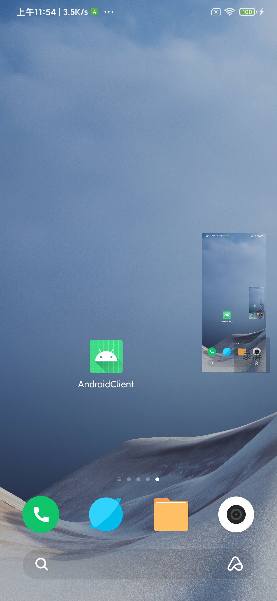

## Socket 使用
* 只是简单的测试学习，打通了Android作为客户端连接server 和 Android作为服务器提供服务以及通过USB传送数据，未来可以做很多的东西，比如实现手机截屏内容实时传输在电脑上，在电脑上用鼠标控制手机
#### 使用Android作为客户端连接服务器
* 通过Wifi 连接， AndroidClient 使用 Socket 连接服务器, 实现了两种，一种是Socket, 一种是前辈封装好的 Java_WebSocket
* Server.java 其实就是使用Socket，服务器使用 ServerSocket，就一个Java文件，main()方法直接允许
* Server文件夹 使用 [Java_WebSocket](https://github.com/TooTallNate/Java-WebSocket),可以找到很多的例子，这个需要使用第三方库，时使用IntelliJ IDAE 创建的一个Java项目

* AndroidClient 的 客户端 里测试使用
    * 默认使用Socket, 即需要启动 Server.java
    * 可以切换为使用 WebSocket, 需要启动 Server文件夹, 地址为测试服务器的地址
    * 先点击 连接（Connect Server）
    * 客户端可以发送消息，但是需要先连接上服务器才可以发消息
    * 服务器在收到客户端的消息后会返回一条消息，客户端使用 (Read From Server)按钮读取服务器的消息

#### 使用Android作为服务器等待客户端连接
* AndroidClient 的 服务器 里开启和关闭服务
    * 根据Android的IP地址连接服务器，测试代码位于 Server文件夹 下 Main.java
    * 通过USB连接后，通过USB连接服务器，测试代码位于 Server文件夹 下 Main.java， 用到了ADBExecutor.java
* 通过WIFI连接，需要知道手机的IP地址
* 通过USB连接，是在手机连接电脑后，通过命令 adb device 可以正常发现设备的情况下，使用命令 adb forward 端口转发
* [adb forward ](https://developer.android.com/studio/command-line/adb) 
    ```
    adb forward tcp:111 tcp:222
    1.操作步骤是手机端先开一个server, 监听222端口
    2.PC端开启一个client, 监听111端口
    命令要在步骤2之前执行

    PC端                        Android手机端
   客户端连接111端口            server监听222端口
        |                           |
        |socket                     |socket
        |                           |
    adb进程监听111  ---adb转发---  adb进程连接到222端口的server

    ```

#### 一个未实现版本的投屏
* 思路（测试代码位于ScreenRecordActivity.java）
    * 从android获取截屏, 使用 MediaProjection
    * andorid作为服务器, 使用WebSocketServer
    * 传送截屏数据
    * PC端展示
* MediaProjection 是从5.0开始的屏幕录制工具，在使用时分为三步，第一步申请文件读写权限，第二步使用MediaProjectionManager申请屏幕录制，第三步开始录制，在Service里进行录制的操作，也可以开一个线程执行
* RecordService.java 里使用MediaRecorder直接保存为视频文件，录制时需要用到VirtualDisplay，设置VirtualDisplay的Surface为MediaRecorder.getSurface()，即可实现录制的内容输入MediaRecorder;
* 为了方便测试，使用系统弹窗实现了一个初级版本的可随手指移动的小浮窗，点击浮窗是唤起录制界面到前台，代码在FloatView.java
* RecordService2使用ImageReader获取每一帧的录屏数据，转换为Bitmap使用FloatView.java展示出来

    
* RecordService3使用MediaCodec对录屏的数据进行编码，编码后的数据可以用于录屏推流，也可以用于保存视频，ScreenRecorder.java 就是直接保存为视频，ScreenRecordEncode.java 对录屏的每一帧进行编码，编码的回调是ScreenRecordCallback.java;
* 对PC端展示不太熟悉，所以测试代码只能暂时止步于此了，但是通过Socket是可以传输数据的，只是PC端展示的问题

#### 搞了个取巧的投屏
* Andoird手机做服务器，截取屏幕
* 另外一个手机连接服务器，接收投屏数据并展示
* 可以实现这个效果，但是问题很大，接收端太卡，Socket传输好像有延时，服务端好像没有内存回收，容易“Waiting for a blocking GC Alloc”内存爆炸，感觉这套投屏方案整体凉凉